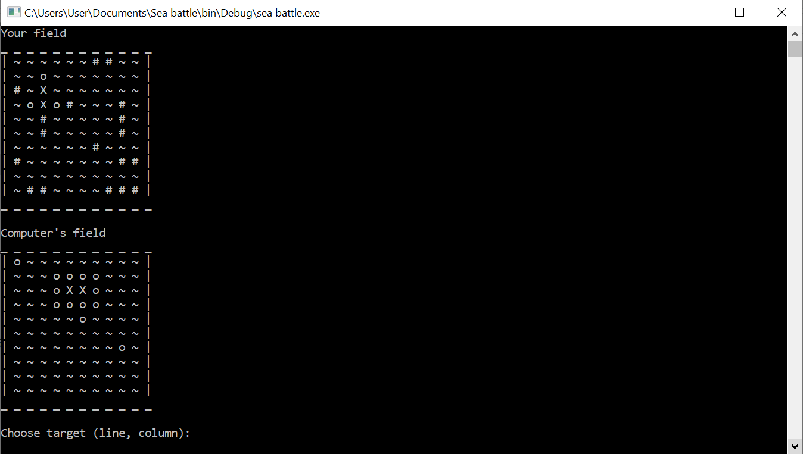

# Sea-battle
Console version of the game "sea battle"

The game is played between you and the computer. At the beginning of the game, the location of your and enemy ships is generated. 
You start the game. You can strike by entering the row and column number. If you hit, then the field is marked with a cross, otherwise a circle. 
You can also see the moves of the computer on your field.

